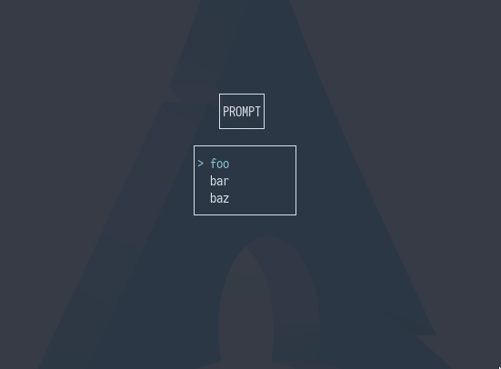

# Go-Org
## Introduction
A very simple CLI menu tool that can be given a number of options, which will be displayed in a TUI menu. The
user can choose between the options through the `vim keys` and finally select an option through `Enter`. The selected option will then
be printed out after the program ends. Simply a terminal version of dmenu, the idea was to use it in conjunction with other scripts (sh/bash) to
make decisions on said scripts more interactive. Also is a great opportunity to learn *golang*.

| :exclamation: Still WIP |
|--------------------------------|

| :attention: The name is go-menu, but it may change to serve |
|--------------------------------|

## Usage
An example the usage can be seen in  video.


## Dependencies
It simply uses Go's built in libraries. So to be able to compile the project, it is only needed to have `Go` installed on your system
### Arch
```sh
sudo pacman -S go
sudo pacman -S delve # for development only
```

### Debian-based
```sh
sudo apt install go
```

### Steps
1. `make build`: pulls necessary dependencies and builds the binary
2. `make install`: installs it onto your system such that it is visible in $PATH (not complete)

### ToDo's
- [ ] figure out how to properly integrate it with scripting, fzf apparently does it right
- [ ] display video of usage properly
- [ ] implement more modes
- [ ] finish implementation `install` target

## Thanks

- [My own template](https://github.com/duclos-cavalcanti/go-project-template)
- [go.dev/doc](https://go.dev/doc/)
- [go-project-example](https://github.com/albertwidi/go-project-example)
