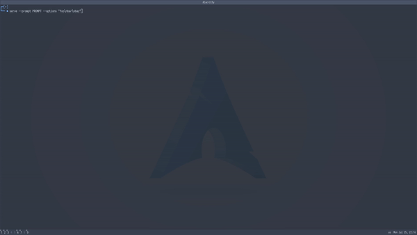

# Serve
A very simple tool that receives a given number of options, displays them in a TUI menu and enables the selection of one of them. The
user can choose between the options through vim keys (`jk`) and finally select an option through `Enter`. The selected option will then
be written to stdout.

## Usage
```sh
serve --prompt PROMPT --options "foo\nbar\nbaz"
```


## Dependencies
It simply uses Go's built in libraries and the amazing [tcell](https://github.com/gdamore/tcell) library. So to be able to compile the project, it is only needed to have `Go` installed on your system
### Arch-based
```sh
sudo pacman -S go
```

### Debian-based
```sh
sudo apt install go
```

## Installation
### Steps
1. `make build`: pulls necessary dependencies and builds the binary
2. `make install`: installs it onto your system such that it is visible in $PATH (not complete)

## Thanks
- [dmenu](http://tools.suckless.org/dmenu/)
- [tcell](https://github.com/gdamore/tcell)
- [go-project-example](https://github.com/albertwidi/go-project-example)

## License
This project is released under the MIT license 3.0. See [LICENSE](LICENSE).

## Contributions
Please follow the instructions in the contributions guide at [CONTRIBUTING.md](CONTRIBUTING.md).

## Donations
I have a ko-fi and a buy-me-a-coffee account, so if you found this repo useful and would like to show your appreciation, feel free to do so!

<p align="center">
<a href="https://ko-fi.com/duclos">

</a>

<a href="https://www.buymeacoffee.com/danielduclos">

</a>

</p>

---
<p align="center">
<a href="https://github.com/duclos-cavalcanti/templates/LICENSE">
  
</a>
</p>

<!-- --- -->
<!-- <a href="https://ko-fi.com/duclos" target="_blank"></a> -->
<!-- <a href="https://www.buymeacoffee.com/danielduclos" target="_blank"></a> -->
<!-- <a href="https://www.paypal.com/donate/?hosted_button_id=NHPMH2UR93APC">  </a> -->
